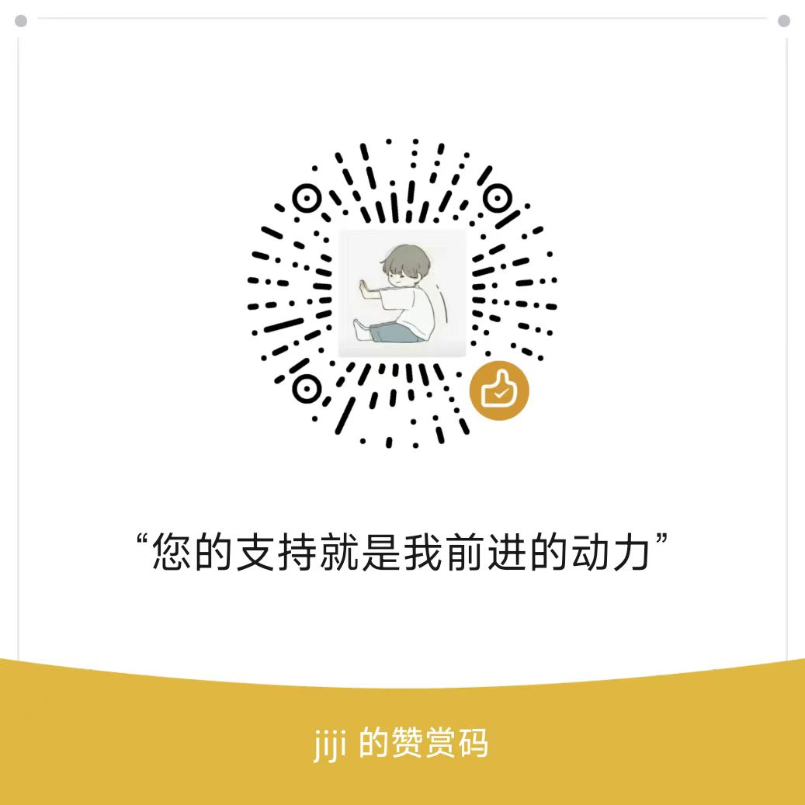

# xiaoya-kits

> 小雅 alist 部署和维护。

## ❤️ 赞助

`xiaoya-kits` 完全免费获取及使用，但是您的赞赏可以鼓励作者维护，万分谢谢！

### 🌟 GitHub Star

请点击 [GitHub](https://github.com/podboy/xiaoya-kits) 右上角的 `⭐ Star` 增加人气，以便更多的人发现此工具。

### 💽 转存阿里云盘文件

点击链接保存，或者复制本段内容，打开「阿里云盘」APP 。

<https://www.alipan.com/s/dn6J8Gg4FUC>

这是一个非常小的文件（仅占用您几KB空间），您的转存可以使作者获得更多的存储空间。

### 💰 打赏

欢迎直接通过打赏来支持作者！



## 🗑️ xiaoya clear-aliyundrive

> 一个清理`阿里云盘`中 `xiaoya` 转存文件的工具。

### 为什么选择 `xiaoya clear-aliyundrive`

相比于其他（使用 `Shell` 开发）的清理脚本，`xiaoya clear-aliyundrive` 的清理更加灵活。

由于 `xiaoya-kits` 基于 `Python` 开发，并且使用了 [xarg-python](https://github.com/bondbox/xarg-python) 模块，因此 `xiaoya clear-aliyundrive` 命令行更为友好，可同时进行多维度的清理过滤，维护也相对来说更加简单。

### 过滤条件

`xiaoya clear-aliyundrive` 会对小雅转存文件夹下的所有文件（包括文件夹）按照 `updated_at` 时间进行排序，所有最新的转存文件会被优先保留。

#### 强制条件

1. 为避免清理正在转存或者刚刚转存的文件，会强制保留 `60` 秒内的文件（和文件夹）。
2. 由于当前文件夹没有 `size` 属性，还无法统计文件夹的占用空间，并且小雅一般转存的都是文件而非文件夹，所以文件夹会被强制清理。
3. 虽然可以根据文件大小来过滤文件，但是（大于空间约束条件的）超大文件总是会被清理，所以必须强制保留一些（没有过时的）文件。

#### 清理过多的文件

`--file`，十进制数，指定最大保留的文件数（默认值为：100）。

按照 `updated_at` 时间进行排序，超过指定数量后的文件会被强制清理。

**默认值 `100` 应该够保持一部电视连续剧了，如果你转存了非常多的小文件，可适当增大此值。**

#### 清理较大的文件

`--byte`，十进制数，最大保留的空间量（默认值为：50.0GB），单位为字节数。

按照 `updated_at` 时间进行排序并计算空间，超过指定空间后的文件会被清理。

**默认值 `50.0GB` 即一半的 `阿里云盘` 永久免费空间，如果您有更多可用空间或可用空间不足，可适当调整此值。**

#### 清理较早的文件

`--minute`，十进制数，最大保留的分钟值（默认值为：24h），单位为分钟。

按照 `updated_at` 时间，和当前时间的差值超过指定分钟数强制清理。

### ⏩ 快速清理（一次性）

使用 `Python>=3.8` 环境，在小雅数据目录下执行以下命令：

```bash
pip3 install --upgrade xiaoya && xiaoya --version
xiaoya clear-aliyundrive --stdout --format
```

### ⏱️ 定时清理

您可以将 `xiaoya clear-aliyundrive` 命令添加到 `crontab` 中，实现定时清理。

### 🪐 持续清理（守护模式）

在小雅数据目录下执行以下命令，使用守护模式持续清理，按 `ctrl+c` 退出：

```bash
pip3 install --upgrade xiaoya && xiaoya --version
xiaoya clear-aliyundrive --stdout --format --daemon
```

### docker 部署

```bash
docker run -v <xiaoya_config_path>:/etc/xiaoya --name xiaoya-clear ghcr.io/podboy/xiaoya-clear:latest
```

环境变量：

- `ROOT`：xiaoya 配置文件目录，默认 `/etc/xiaoya`
- `LEVEL`：日志级别，默认 `info`
- `MAX_INTERVAL`：两次清理的最大间隔时间，单位秒，默认 `300`
- `MAX_RESERVED_FILE`：每次清理最大保留的文件数，默认 `100`
- `MAX_RESERVED_BYTE`：每次清理最大保留的空间量，单位字节，默认 `53687091200`
- `MAX_RESERVED_MINUTE`：每次清理大保留的分钟值，默认 `1440`

**docker-compose**

```yaml
version: '3'
services:
    podboy:
        image: 'ghcr.io/podboy/xiaoya-clear:latest'
        container_name: xiaoya-clear
        volumes:
            - '<xiaoya_config_path>:/etc/xiaoya'
```
